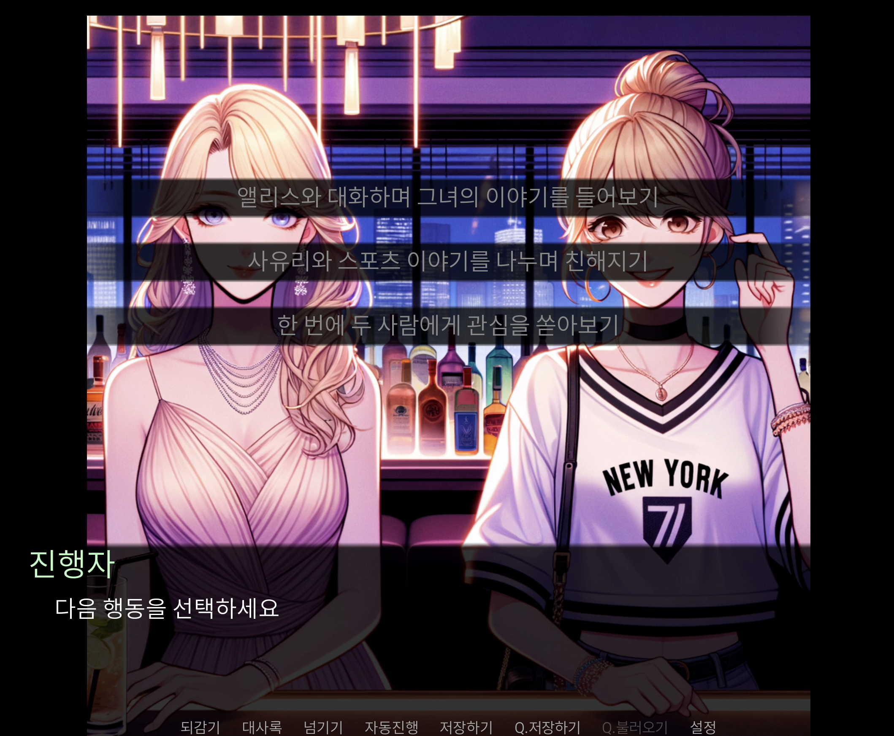

# ChatGPT의 미연시 게임

## Visual Novel Game Powered by ChatGPT
GPT-4o와 DALL-E 3를 활용한 동적 스토리텔링 비주얼 노벨 게임. AI가 실시간으로 스토리를 생성하고 이미지를 만들어내는 독특한 게임 시스템.

A dynamic storytelling visual novel game powered by GPT-4o and DALL-E 3. A unique gaming system where AI generates stories and creates images in real-time.

## Main Features
- GPT-4o를 통한 실시간 스토리 생성
- DALL-E 3를 활용한 애니메이션 스타일 이미지 자동 생성
- 매 상황마다 여러 선택지 제공
- 이전 선택에 따른 스토리 맥락 유지 (최근 3개 컨텍스트 저장)

## Installation
1. [Ren'Py 엔진](https://www.renpy.org/latest.html) 설치 및 실행
2. 새로운 Ren'Py 프로젝트 생성
3. script.rpy 파일을 프로젝트 폴더에 복사
4. [OpenAI API](https://platform.openai.com/api-keys) 키 발급
5. script.rpy 파일의 `YOUR_API_KEY` 부분을 발급받은 API 키로 교체

## Requirements
- Python 3.x
- Ren'Py 엔진
- 인터넷 연결
- OpenAI API 키

## Notes
- API 사용량에 따른 과금 발생 가능성
- 안정적인 인터넷 연결 필요
- 생성된 이미지는 로컬의 'images' 폴더에 저장됨

## Technical Stack
- [Ren'Py](https://www.renpy.org)
- [Python](https://www.python.org)
- [OpenAI GPT-4o API](https://openai.com/index/hello-gpt-4o/)
- [DALL-E 3 API](https://openai.com/index/dall-e-3)
